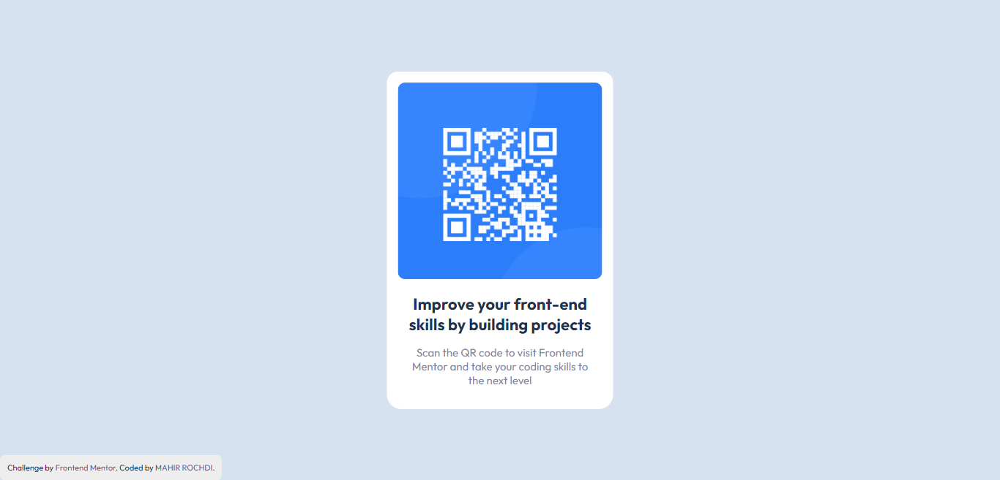

# Frontend Mentor - QR code component solution

This is a solution to the [QR code component challenge on Frontend Mentor](https://www.frontendmentor.io/challenges/qr-code-component-iux_sIO_H). Frontend Mentor challenges help you improve your coding skills by building realistic projects. 

## Table of contents

- [Overview](#overview)
  - [Screenshot](#screenshot)
  - [Links](#links)
- [My process](#my-process)
  - [Built with](#built-with)
- [Author](#author)

## Overview

### Screenshot

### Links

- Solution URL: [Add solution URL here](https://your-solution-url.com)
- Live Site URL: 

## My process

### Built with

- Html5
- CSS3

## Author

- Website - [Mahir Rochdi]
- Frontend Mentor - [@MAHIRROCHDI](https://www.frontendmentor.io/profile/MAHIRROCHDI)
- Linkedin - [@rochdi-mahir](www.linkedin.com/in/rochdi-mahir)
